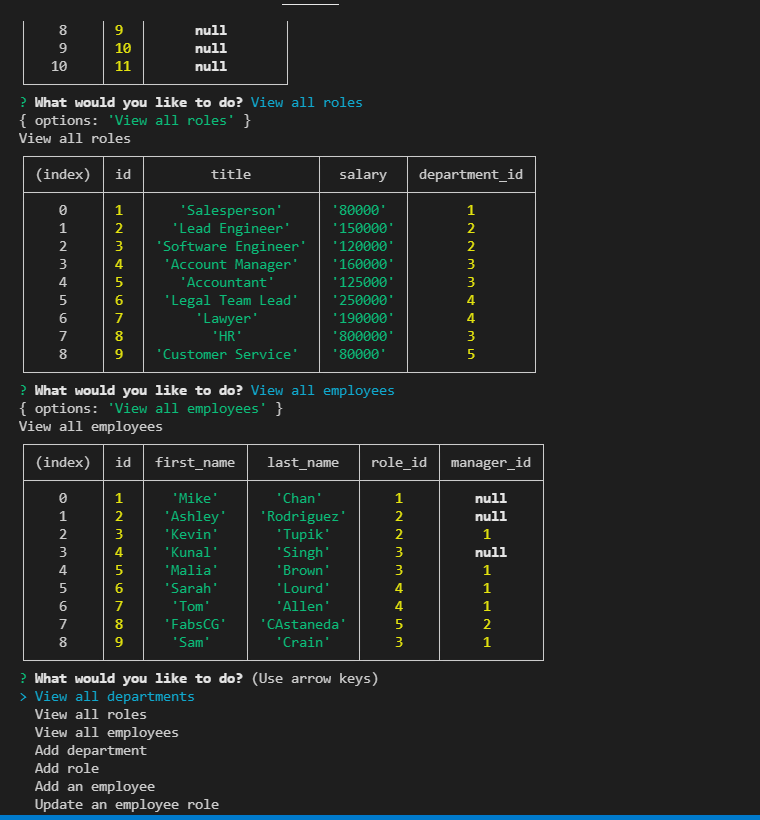

  # Staff-Tracker

  # Table of Contents
  _________________________________

[Description](#Description)

[Installations](#Installations)

[Usage](#Usage)

[Credits](#Credits)

[License](#License)

[Test](#Test)

[Questions](#Questions)
 

  # Description
   AS A business owner I WANT to be able to view and manage the departments, roles and employee in my company, SO THAT I can organize and plan my business.

  # Installation
     MySQL2, Inquirer, console.table

  # Usage
  Use the command-line and use "node server.js" or "npm start" to start accepting the user input 

  # Credits
  none

  # License
  
  
  # Test
    npm start

  # Questions
  _________________________________

  ## If you have any further questions about this project, you can always contact me here:(Click Enter)

  ## Name
  Fabiola C. Gamboa

  ## [Github](https://github.com/fabiscg79@gmail.com)
  

  ## [Email](Fabskickass)

  ##  

  ## [Video Demo](https://drive.google.com/file/d/1B1oK9ertTc6fyjEyPkBCAq62WxR3EfGY/view)

  
